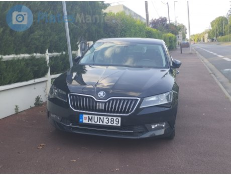

# PyPlateX
High-Performance Scalable ANPR Package: Ready-to-Use, Simple, and Efficient License Plate Recognition

Unlock top-tier accuracy and scalability with our cutting-edge ANPR solution **in 3 line of code**. Designed for seamless integration and ease of use, it delivers robust performance and reliability for all your license plate recognition needs.


[](https://pepy.tech/project/pyplatex)
[](https://pypi.org/project/pyplatex)


[](https://pepy.tech/project/pyplatex)


## Simple ready to use ANPR 

**Note: The ANPR.detect function is asynchronous, so ensure you use the await keyword when calling it within an async function.**

### Install from pypi.org

```sh
pip install pyplatex
```

```py
from pyplatex import ANPR
anpr = ANPR()
det = await anpr.detect('./demo/plate-1.jpg')
print(det)
```
or

```py

from pyplatex import ANPR
import asyncio

async def main():
    anpr = ANPR()
    plates = await anpr.detect('./demo/plate-1.jpg')
    print(plates)

# Run the async main function
asyncio.run(main())

```
the output would be like



```
<<<<<<< HEAD
    {
        'is_plate': True, 
        'is_plate_confidence': 0.78, 
        'plate_number': 'MUN389', 
        'plate_number_confidence': 1.0
    }
=======
{
    'is_plate': True, 'is_plate_confidence': 0.75, 
    'plate_number': 'HR 26D05551', 
    'plate_number_confidence': 0.78
}
>>>>>>> 20a08abe67361096a0815373d9062a8d86c2e4f7
```


### Dev TODO:
- [x] Release a Inital Version
- [x] Add a plate detection model
- [x] Read and detect Plates
- [x] Format output
- [x] Integrate Cv2filters
- [x] Change Cofidence to a round number
- [x] Add a ocr Model
- [x] Release a Initial Version
- [ ] Add a option to accept image as Tensor / numpy array
- [ ] Add auto filters tag
<!-- [ ] -->

**This is a pre-release version; there might be some bugs. If you encounter any issues or performance-related problems, please report them [here](https://github.com/nuhmanpk/pyplatex/issues). If you'd like to contribute to this project, you can create a pull request [here](https://github.com/nuhmanpk/pyplatex/pulls).**

**Warning: Use this pre-release with caution as it may still have unresolved issues.**

Happy Coding 🚀 ...
